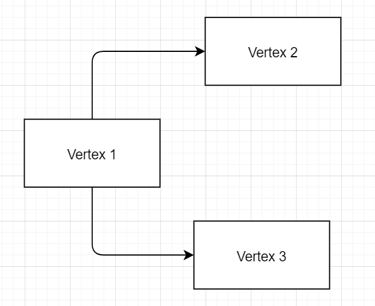

# AsyncHelpers
Helper library for async operations.

Contains:
* RechargeableCompletionSource
* ValueTaskCompletionSource
* SinglePhaseAsyncBarrier
* ContinuationQueue
* AsyncLockDAGVertex
* TaskExtensions

### RechargeableCompletionSource
TaskCompletionSource analogue with some kind of reset operation that could be used multiple times in producer–consumer scenario.
```C#
var runContinuationsAsynchronously = false;
var rtcs = new RechargeableCompletionSource<int>(runContinuationsAsynchronously);

_ = Task.Run(async () =>
{
    while (true)
    {
        using var data = await rtcs.GetValueAsync();
        Console.WriteLine($"Get {data.Value} on Thread {Thread.CurrentThread.ManagedThreadId}");
    }
});

Thread.Sleep(1000);

_ = Task.Run(() =>
{
    int i = 0;
    while (true)
    {
        Thread.Sleep(1_000);
        Console.WriteLine($"Add {i} on Thread {Thread.CurrentThread.ManagedThreadId}");
        rtcs.SetResultAndWait(i++);
    }
});

Console.ReadKey();
```

Output
```
Add 0 on Thread 4
Get 0 on Thread 4
Add 1 on Thread 4
Get 1 on Thread 4
Add 2 on Thread 4
Get 2 on Thread 4
Add 3 on Thread 4
Get 3 on Thread 4
```
for 
```C#
var runContinuationsAsynchronously = true; 
```
we will have Thread switching in Get part

```
Add 0 on Thread 4
Get 0 on Thread 5
Add 1 on Thread 4
Get 1 on Thread 5
Add 2 on Thread 4
Get 2 on Thread 5
Add 3 on Thread 4
Get 3 on Thread 6
```

### ValueTaskCompletionSource

IValueTaskSource based analogue of TaskCompletionSource without allocation on async way.

```C#
ValueTaskCompletionSource<int> vtcs = new ValueTaskCompletionSource<int>(false);
AutoResetEvent are = new AutoResetEvent(false);

var t1 = Task.Run(() =>
{
    int v = 0;
    while (true)
    {
        Thread.Sleep(1_000); // attempts to execute await t before set result
        vtcs.SetResult(v++);
        are.WaitOne();
    }
});

var t2 = Task.Run(async () =>
{
    while (true)
    {
        ValueTask<int> t = vtcs.Task;
        var result = await t;
        Console.WriteLine($"{result}");
        are.Set();
    }
});

await Task.WhenAll(t1, t2);
```

### SinglePhaseAsyncBarrier

Async version of Barrier with single phase of work.

```C#
SinglePhaseAsyncBarrier spb = new SinglePhaseAsyncBarrier(3);

var t1 = Task.Run(async () =>
{
   Thread.Sleep(1_000);
   Console.WriteLine("Task A Added");
   await spb.SignalAndWaitAsync();
   Console.WriteLine("A Done");
});

var t2 = Task.Run(async () =>
{
    Thread.Sleep(2_000);
    Console.WriteLine("Task B Added");
    await spb.SignalAndWaitAsync();
    Console.WriteLine("B Done");
});

var t3 = Task.Run(async () =>
{
    Thread.Sleep(3_000);
    Console.WriteLine("Task C Added");
    await spb.SignalAndWaitAsync();
    Console.WriteLine("C Done");
});

await Task.WhenAll(t1, t2, t3);
```

Output

```
Task A Added
Task B Added
Task C Added
C Done
A Done
B Done
```

### ContinuationQueue
Queue that registers continuations and runs them one be one.

```C#
ContinuationQueue cq = new ContinuationQueue();

var t1 = Task.Run(async () =>
{
   Thread.Sleep(100);
   Console.WriteLine("Task A Added");
   await cq.WaitAsync();
   Console.WriteLine("A Done");
});

var t2 = Task.Run(async () =>
{
    Thread.Sleep(200);
    Console.WriteLine("Task B Added");
    await cq.WaitAsync();
    Console.WriteLine("B Done");
});

Thread.Sleep(1_000);
Console.WriteLine("FinishTask");
cq.FinishTask();
Thread.Sleep(1_000);
Console.WriteLine("FinishTask");
cq.FinishTask();

await Task.WhenAll(t1, t2);

```

Output

```
Task A Added
Task B Added
FinishTask
A Done
FinishTask
B Done
```
### AsyncLockDAGVertex
Directed acyclic graph that allows to take asynchronous locks on its nodes.
Lock on parent also locks all childs, but lock on child does not affect other childs of this parent.



```C#
var vertex1 = new VertexWithValue(1);
var vertex2 = new VertexWithValue(2);
var vertex3 = new VertexWithValue(3);
vertex1.AddEdgesTo(vertex2, vertex3);
vertex1.ValidateGraph();

var vertex1Task = Task.Run(async () =>
{
    while (true)
    {
        await Task.Delay(500); // Run interval.
        using var _ = await vertex1.GetLockAsync(CancellationToken.None).ConfigureAwait(false);
        Console.WriteLine($"Start updating [{vertex1}]");
        vertex1.Value++;
        await Task.Delay(5000).ConfigureAwait(false);  // Some async work.
        Console.WriteLine($"End updating [{vertex1}]");
    }
});

var vertex2Task = Task.Run(async () =>
{
    while (true)
    {
        await Task.Delay(400); // Run interval.
        using var _ = await vertex2.GetLockAsync(CancellationToken.None).ConfigureAwait(false);
        Console.WriteLine($"    Start updating [{vertex2}]");
        vertex2.Value++;
        await Task.Delay(1000).ConfigureAwait(false);  // Some async work.
        Console.WriteLine($"    End updating [{vertex2}]");
    }
});

var vertex3Task = Task.Run(async () =>
{
    while (true)
    {
        await Task.Delay(400); // Run interval.
        using var _ = await vertex3.GetLockAsync(CancellationToken.None).ConfigureAwait(false);
        Console.WriteLine($"    Start updating [{vertex3}]");
        vertex3.Value++;
        await Task.Delay(1000).ConfigureAwait(false);  // Some async work.
        Console.WriteLine($"    End updating [{vertex3}]");
    }
});

await Task.WhenAll(vertex1Task, vertex2Task, vertex3Task).ConfigureAwait(false);
```

Output

```
    Start updating [V2 => 0]
    Start updating [V3 => 0]
    End updating [V2 => 1]
    End updating [V3 => 1]
Start updating [V1 => 0]
End updating [V1 => 1]
    Start updating [V2 => 1]
    Start updating [V3 => 1]
    End updating [V3 => 2]
    End updating [V2 => 2]
Start updating [V1 => 1]
End updating [V1 => 2]
    Start updating [V3 => 2]
    Start updating [V2 => 2]
```

### TaskExtensions

#### WaitAllTasksButCheckAsync
Waits all tasks but invoke OnFaulted if any task is failed.

```C#
var t1 = Task.Run(() =>
{
    Thread.Sleep(1_000);
    throw new InvalidOperationException();
});

var t2 = Task.Run(() =>
{
    Thread.Sleep(10_000);
    Console.WriteLine("T2 Done");
});

await new[] { t1, t2 }.WaitAllTasksButCheckAsync(() =>
{
    Console.WriteLine("Rise error without waiting 10 seconds for second task.");
});
```

#### TryExecuteWithTimeoutAsync
Attempts to execute async operation within the expected time.

```C#
Task task = ...;
var timeout = 1000;
var isExecutedInTimeout = await task.TryExecuteWithTimeoutAsync(timeout, CancellationToken.None);
```

#### WithCancellation
Attempts to wait some task with cancellation token

```C#
var tcs = new TaskCompletionSource<int>();
var timeout = 1000;
using var cts = new CancellationTokenSource(timeout);

try
{
    await tcs.Task.WithCancellation(cts.Token).ConfigureAwait(false);
}
catch (OperationCanceledException)
{
    Console.WriteLine("Task was canceled");
}
```

#### WhenAllOrError
Waits all tasks but stops if any is failed or cancelled

```C#
var tcs1 = new TaskCompletionSource<int>();
var tcs2 = new TaskCompletionSource<int>();
var tcs3 = new TaskCompletionSource<int>();

_ = Task.Delay(1000).ContinueWith(_ => tcs3.SetException(new InvalidOperationException()));

try
{
    await Extensions.WhenAllOrError(tcs1.Task, tcs2.Task, tcs3.Task).ConfigureAwait(false);
}
catch (InvalidOperationException)
{
    Console.WriteLine("Error on await");
}
```
